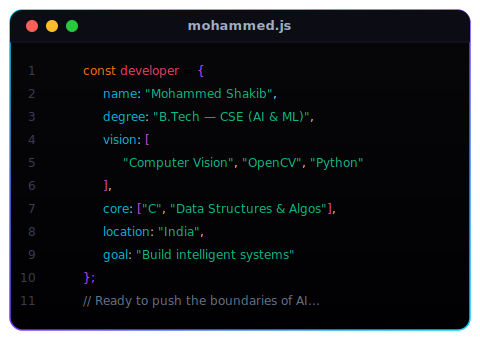
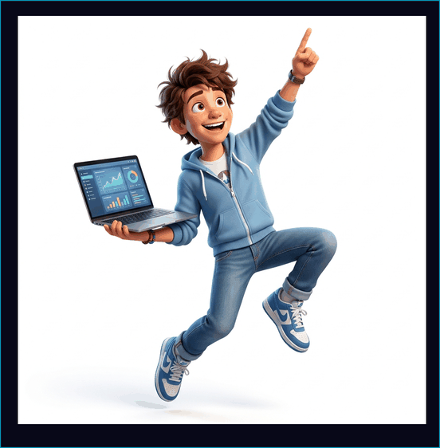
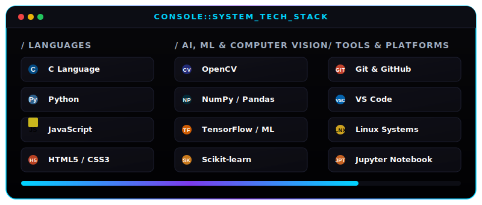

<!-- HEADER BANNER -->

 

<!-- TYPING ANIMATION -->

<!-- BADGES -->

---

<!-- SIDE-BY-SIDE DASHBOARD (ABOUT ME & CHARACTER) -->
<table border="0" cellpadding="0" cellspacing="0" width="100%">
  <tr>
    <td width="55%" valign="top" align="left" style="border: none; padding-right: 10px;">
      <h3 style="color: #ffffff; font-family: 'Segoe UI', sans-serif;">🧑‍💻 System Profile</h3>
      
    </td>
    <td width="45%" valign="top" align="center" style="border: none; padding-left: 10px;">
      <h3 style="color: #ffffff; font-family: 'Segoe UI', sans-serif;">🤖 Hologram Status</h3>
      
    </td>
  </tr>
</table>

---

<!-- TECH STACK CONSOLE -->
<h3 style="color: #ffffff; font-family: 'Segoe UI', sans-serif;">🛠️ Tech Arsenal</h3>

---

<!-- FEATURED PROJECTS GRID -->
<h3 style="color: #ffffff; font-family: 'Segoe UI', sans-serif;">🚀 Featured Repositories</h3>

<table width="100%" style="border-collapse: collapse; border: none; font-family: 'Segoe UI', sans-serif;">
  <tr>
    <td width="50%" valign="top" style="border: 1px solid #1c1e2f; border-radius: 8px; padding: 15px; background-color: #050508;">
      

        👁️ GestureVision X
      

      

        Real-time hand gesture recognition via webcam using AI and advanced Computer Vision.
      

      

        
        
        
      

      
    </td>
    <td width="50%" valign="top" style="border: 1px solid #1c1e2f; border-radius: 8px; padding: 15px; background-color: #050508;">
      

        🌐 Personal Portfolio
      

      

        A modern, highly interactive portfolio website showcasing professional skills and projects.
      

      

        
        
        
      

      
    </td>
  </tr>
  <tr>
    <td width="50%" valign="top" style="border: 1px solid #1c1e2f; border-radius: 8px; padding: 15px; background-color: #050508; border-top: none;">
      

        🗂️ Data Structures in C
      

      

        Complete implementations of core data structures: Stacks, Queues, Linked Lists, and Trees from scratch.
      

      

        
        
      

      
    </td>
    <td width="50%" valign="top" style="border: 1px solid #1c1e2f; border-radius: 8px; padding: 15px; background-color: #050508; border-top: none;">
      

        📚 PPS Coding in C
      

      

        Fundamental programming and problem-solving exercises in C for computer science studies.
      

      

        
        
      

      
    </td>
  </tr>
</table>

---

<!-- GITHUB DIAGNOSTICS & ANALYTICS -->
<h3 style="color: #ffffff; font-family: 'Segoe UI', sans-serif;">📊 System Diagnostics</h3>

<table border="0" cellpadding="0" cellspacing="0" width="100%">
  <tr>
    <td width="50%" align="center" style="border: none; padding-right: 5px;">
      
    </td>
    <td width="50%" align="center" style="border: none; padding-left: 5px;">
      
    </td>
  </tr>
</table>

 

  

---

<!-- CONTRIBUTION SNAKE -->
<h3 style="color: #ffffff; font-family: 'Segoe UI', sans-serif;">🐍 Matrix Stream</h3>

  <picture>
    <source media="(prefers-color-scheme: dark)" srcset="https://raw.githubusercontent.com/5645mohammedshakib/5645mohammedshakib/output/github-snake-dark.svg"/>
    <source media="(prefers-color-scheme: light)" srcset="https://raw.githubusercontent.com/5645mohammedshakib/5645mohammedshakib/output/github-snake.svg"/>
    
  </picture>

---

<!-- CONNECT SECTION -->
<h3 style="color: #ffffff; font-family: 'Segoe UI', sans-serif;" align="center">📬 Establish Connection</h3>

 

<!-- FOOTER -->

  

