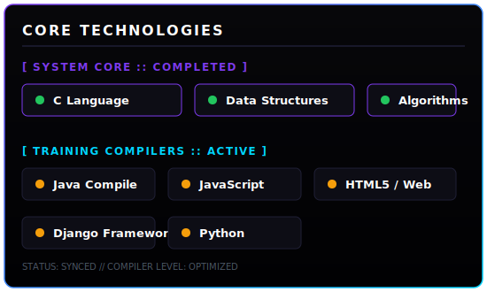

<!-- HEADER BANNER -->

 

<!-- TYPING ANIMATION -->

<!-- BADGES -->

---

<!-- SIDE-BY-SIDE CORE TECHNOLOGIES & LANGUAGE DISTRIBUTION -->
<table border="0" cellpadding="0" cellspacing="0" width="100%">
  <tr>
    <td width="50%" valign="top" align="left" style="border: none; padding-right: 10px;">
      <h3 style="color: #ffffff; font-family: 'Segoe UI', sans-serif;">🛠️ Core Technologies</h3>
      
    </td>
    <td width="50%" valign="top" align="center" style="border: none; padding-left: 10px;">
      <h3 style="color: #ffffff; font-family: 'Segoe UI', sans-serif;">📊 Language Distribution</h3>
      
    </td>
  </tr>
</table>

---

<!-- NOTABLE PROJECTS GRID (CHECKMYGIT STYLE) -->
<h3 style="color: #ffffff; font-family: 'Segoe UI', sans-serif;">📁 Notable Projects</h3>

<table width="100%" style="border-collapse: collapse; border: none; font-family: 'Segoe UI', sans-serif;">
  <tr>
    <!-- Project 1 -->
    <td width="50%" valign="top" style="border: 1px solid #1a1a2e; border-radius: 8px; padding: 15px; background-color: #050508;">
      

        <a href="https://github.com/5645mohammedshakib/ds-using-c" style="color: #00d4ff; text-decoration: none;">ds-using-c</a>
      

      

        Complete implementations of core data structures: Stacks, Queues, Linked Lists, and Trees from scratch.
      

      

        
        C
        ★ Active
      

    </td>
    <!-- Project 2 -->
    <td width="50%" valign="top" style="border: 1px solid #1a1a2e; border-radius: 8px; padding: 15px; background-color: #050508;">
      

        <a href="https://github.com/5645mohammedshakib/pps-coding-in-c-language" style="color: #00d4ff; text-decoration: none;">pps-coding-in-c-language</a>
      

      

        Fundamental programming and problem-solving exercises in C for computer science studies.
      

      

        
        C
        ★ Active
      

    </td>
  </tr>
  <tr>
    <!-- Project 3 -->
    <td width="50%" valign="top" style="border: 1px solid #1a1a2e; border-radius: 8px; padding: 15px; background-color: #050508; border-top: none;">
      

        <a href="https://github.com/5645mohammedshakib/portfolio" style="color: #00d4ff; text-decoration: none;">portfolio</a>
      

      

        A modern, highly interactive portfolio website showcasing professional skills and projects.
      

      

        
        JavaScript
        ★ Active
      

    </td>
    <!-- Project 4 -->
    <td width="50%" valign="top" style="border: 1px solid #1a1a2e; border-radius: 8px; padding: 15px; background-color: #050508; border-top: none;">
      

        <a href="https://github.com/5645mohammedshakib/gestureVision_X" style="color: #00d4ff; text-decoration: none;">gestureVision_X</a>
      

      

        Real-time hand gesture recognition via webcam using AI and advanced Computer Vision.
      

      

        
        Python
        ★ Active
      

    </td>
  </tr>
</table>

---

<!-- SYSTEM ACTIVITY GRAPH -->
<h3 style="color: #ffffff; font-family: 'Segoe UI', sans-serif;">📈 Activity Analytics</h3>

  

---

<!-- MATRIX STREAM (SNAKE) -->
<h3 style="color: #ffffff; font-family: 'Segoe UI', sans-serif;">🐍 Matrix Stream</h3>

  <picture>
    <source media="(prefers-color-scheme: dark)" srcset="https://raw.githubusercontent.com/5645mohammedshakib/5645mohammedshakib/output/github-snake-dark.svg"/>
    <source media="(prefers-color-scheme: light)" srcset="https://raw.githubusercontent.com/5645mohammedshakib/5645mohammedshakib/output/github-snake.svg"/>
    
  </picture>

---

<!-- ESTABLISH CONNECTION -->
<h3 style="color: #ffffff; font-family: 'Segoe UI', sans-serif;" align="center">📬 Establish Connection</h3>

 

<!-- FOOTER -->

  

